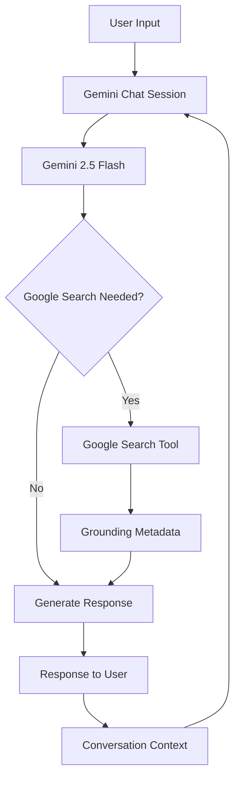

# 🤖 Gemini Grounded Chatbot

> A conversational AI experiment built with the **Google Gemini API**, combining multi-turn conversation with **Google Search grounding** to bring real-time information into AI responses.


---

## 🌐 Why Grounding Matters

Large language models are powerful at generating answers, but they don't automatically know what is happening **right now**.

Ask a model about a recent event, today's information, or something that changed recently, and relying only on its internal knowledge can produce outdated or incorrect results.

This project explores a simple but important idea:

> **Let the model search for current information when the question needs it.**

The chatbot connects **Gemini 2.5 Flash** with Google's Search tool, allowing responses to be grounded in information retrieved from the web.

---

## 🧠 The Core Idea

The system follows this loop:

```text
                  ┌──────────────────┐
                  │    User Prompt   │
                  └────────┬─────────┘
                           │
                           ▼
                  ┌──────────────────┐
                  │ Gemini Chat      │
                  │ Session          │
                  └────────┬─────────┘
                           │
                    Does the query
                    need fresh info?
                       /       \
                     Yes        No
                     /           \
                    ▼             ▼
          ┌────────────────┐   ┌─────────────┐
          │ Google Search  │   │ Gemini      │
          │ Grounding Tool │   │ Knowledge   │
          └───────┬────────┘   └──────┬──────┘
                  │                   │
                  └─────────┬─────────┘
                            ▼
                  ┌──────────────────┐
                  │ Grounded Gemini  │
                  │     Response     │
                  └──────────────────┘
```

The important part is that **search is exposed to Gemini as a tool**, rather than manually building a separate search pipeline.

---

## 🔍 Gemini + Google Search

The project uses the Google GenAI SDK to provide Gemini with a Google Search tool.

Conceptually:

```text
Gemini
  │
  │ decides it needs external information
  ▼
Google Search Tool
  │
  │ retrieves current information
  ▼
Grounding Metadata
  │
  ▼
Gemini Response
```

The application also checks the returned `grounding_metadata` to determine whether Google Search was used and prints the search queries generated during the interaction.

This makes the grounding process observable instead of treating it as a hidden operation.

---

## 💬 Conversations That Keep Context

The chatbot isn't implemented as independent one-off prompts.

A Gemini chat session is created once and reused:

```text
User: "Who is the current CEO of X?"
          ↓
Gemini + Search
          ↓
Response
          │
          │ conversation state retained
          ▼
User: "What did they say about AI?"
          ↓
Gemini uses previous context
          ↓
Context-aware response
```

This allows follow-up questions to build naturally on previous turns.

---

## ⚙️ Under the Hood

The application is intentionally small, but several important pieces are working together:



### Main components

| Component              | Responsibility                       |
| ---------------------- | ------------------------------------ |
| **Gemini 2.5 Flash**   | Generates conversational responses   |
| **Google Search**      | Provides fresh web information       |
| **Google GenAI SDK**   | Connects Python to Gemini            |
| **Chat Session**       | Maintains multi-turn context         |
| **Grounding Metadata** | Exposes search/grounding information |
| **Python CLI**         | Provides the user interaction layer  |

---

## 🧱 Architecture at a Glance

```text
┌─────────────────────────────────────────────┐
│                  USER                       │
│                                             │
│   "Ask a question about something current" │
└──────────────────────┬──────────────────────┘
                       │
                       ▼
┌─────────────────────────────────────────────┐
│             CHAT SESSION                    │
│                                             │
│        Gemini 2.5 Flash + Config            │
└──────────────────────┬──────────────────────┘
                       │
                       ▼
┌─────────────────────────────────────────────┐
│              TOOL LAYER                     │
│                                             │
│        Google Search Grounding              │
└──────────────────────┬──────────────────────┘
                       │
                       ▼
┌─────────────────────────────────────────────┐
│             RESPONSE LAYER                  │
│                                             │
│  Answer + Grounding Metadata + Search Info  │
└─────────────────────────────────────────────┘
```

---

## 🧪 What Makes This Different From a Basic Chatbot?

A conventional API chatbot might look like:

```text
Prompt → Model → Response
```

This project introduces an external information source:

```text
Prompt
  ↓
Model
  ↓
Tool Decision
  ↓
Google Search
  ↓
Grounded Context
  ↓
Model
  ↓
Response
```

That small architectural change introduces an important concept in modern AI applications:

### **Tool-augmented generation**

The model isn't limited to generating from its internal knowledge—it can interact with an external capability when required.

---

## 📁 Project Structure

```text
Advanced-Generative-AI-Chatbot-with-Real-Time-Grounding/
│
├── chatbot.py
├── requirements.txt
└── README.md
```

### `chatbot.py`

Contains the complete chatbot implementation:

* Gemini client initialization
* Google Search tool configuration
* Chat session creation
* User input loop
* Response generation
* Grounding metadata inspection
* Error handling

### `requirements.txt`

Defines the Python dependencies required to run the application.

---

## 🛠️ Tech Stack

### AI

* **Google Gemini 2.5 Flash**
* **Google Search grounding**

### Development

* **Python**
* **Google GenAI SDK**
* **python-dotenv**

### Architecture Concepts

* Generative AI
* Tool calling
* Grounded generation
* Multi-turn conversations
* External information retrieval
* API-based AI applications

---

## 🚀 Getting Started

### 1. Clone the repository

```bash
git clone https://github.com/taniiishaa/Advanced-Generative-AI-Chatbot-with-Real-Time-Grounding.git

cd Advanced-Generative-AI-Chatbot-with-Real-Time-Grounding
```

### 2. Install dependencies

```bash
pip install -r requirements.txt
```

### 3. Configure your API key

Set your Gemini API key as an environment variable:

```text
GEMINI_API_KEY=your_api_key_here
```

You can also use a `.env` file locally.

**Never commit your API key to GitHub.**

### 4. Start the chatbot

```bash
python chatbot.py
```

You should see:

```text
--- Gemini Chatbot Initialized (with Google Search) ---
Start chatting. Ask a current events question.
```

Then start chatting directly from the terminal.

---

## 🧪 Example Interaction

```text
You: What are the latest developments in generative AI?

Gemini (Grounded):
[Generated response based on current information]

[Used Google Search with queries: [...]]
```

You can then continue the conversation:

```text
You: Which one is most significant?

Gemini:
[Context-aware response]
```

To exit:

```text
You: quit
```

or:

```text
You: exit
```

---

## 🔐 Environment Variables

The application expects:

```text
GEMINI_API_KEY
```

Recommended local setup:

```text
project/
│
├── chatbot.py
├── requirements.txt
├── .env
└── README.md
```

Example `.env`:

```text
GEMINI_API_KEY=your_key_here
```

Add `.env` to `.gitignore` before pushing the project.

---

## 🧩 Concepts Explored

This project served as a practical introduction to several ideas behind modern AI applications:

### 01 — Generative AI

Using a foundation model to generate natural-language responses.

### 02 — Tool Use

Giving an AI model access to an external capability rather than relying entirely on its built-in knowledge.

### 03 — Grounding

Connecting generated answers with externally retrieved information.

### 04 — Multi-turn Context

Maintaining a conversation through a persistent chat session.

### 05 — API Integration

Connecting a Python application to a cloud-based generative AI service.

### 06 — Observability

Inspecting grounding metadata and search queries to understand when external information was used.

---

## 🔬 From Chatbot → AI System

The project demonstrates a progression:

```text
                BASIC CHATBOT
                     │
                     ▼
              Model API Call
                     │
                     ▼
              Multi-turn Chat
                     │
                     ▼
                Tool Calling
                     │
                     ▼
              Google Search
                     │
                     ▼
            Grounded Generation
                     │
                     ▼
             More Useful AI
```

This pattern is one of the foundations behind more advanced AI applications where models interact with **tools, APIs, databases and external services**.

---

## 🚀 Possible Extensions

This implementation is intentionally lightweight, but it provides a foundation for expanding the system into a richer AI application.

### Interface

* Streamlit or web-based chat UI
* Streaming responses
* Conversation sidebar
* Chat history export

### Intelligence

* Custom system instructions
* Specialized AI personas
* Structured responses
* Query classification
* Better source presentation

### Tools

```text
Gemini
  │
  ├── 🔎 Google Search
  ├── 📄 Document Retrieval
  ├── 🗄️ Database
  ├── 🌐 APIs
  └── 🧮 Custom Tools
```

### Advanced Architecture

The next evolution could introduce a proper **RAG pipeline**, where the model can retrieve information from a private knowledge base in addition to the public web.

---

## 🎯 Project Takeaway

The most important lesson from this project is that building useful AI applications is not only about choosing a powerful model.

The surrounding system matters:

```text
             MODEL
               +
             CONTEXT
               +
             TOOLS
               +
           EXTERNAL DATA
               ↓
        USEFUL AI SYSTEM
```

This project was an early exploration of that idea—moving from a simple **"ask the model"** interaction toward an AI system that can **use external information to improve its responses**.
